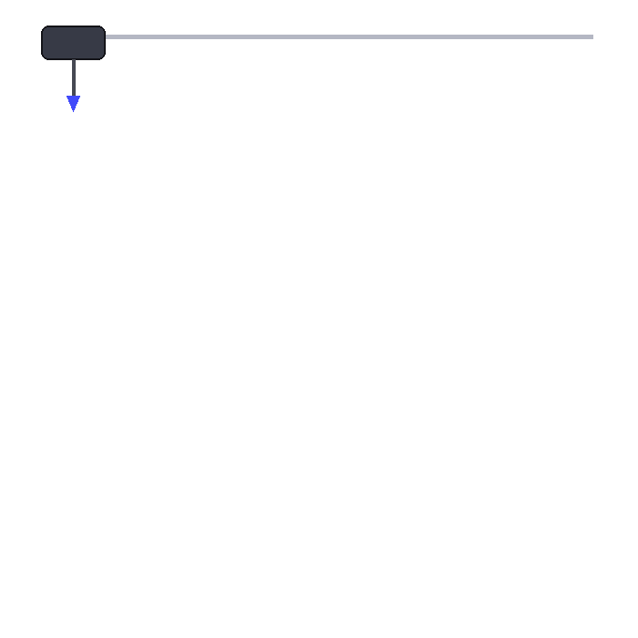

<div align="center">


<br>



<br><br>


<br><br>

<a href="https://github.com/Luizfmaia10-dev">

</a>

<a href="https://www.linkedin.com/in/luiz-maia-4a1919359/">

</a>

<br><br>


</div>

---

# 👨‍💻 Sobre mim

> **Transformando aprendizado em código e código em soluções.**

Sou **Luiz Fernando Maia**, estudante de **Engenharia de Software na PUC Minas**, atualmente no 3º semestre.

Meu foco é transformar problemas em soluções através do desenvolvimento de software, explorando tecnologias, inteligência artificial e produtos digitais.

---

# ⚡ Tech Stack

<div align="center">


</div>

---

# 🧠 Atualmente

<div align="center">

```text
╭────────────────────────────────────────────────────╮
│                                                    │
│   🎓 Engenharia de Software                        │
│                                                    │
│   ☕ Java + Spring Boot                            │
│                                                    │
│   🐍 Python                                        │
│                                                    │
│   ⚙️ C / C++                                       │
│                                                    │
│   🤖 Inteligência Artificial                       │
│                                                    │
│   🚀 SaaS & Produtos Digitais                     │
│                                                    │
│   🧠 Engenharia de Software                       │
│                                                    │
╰────────────────────────────────────────────────────╯
```

</div>

---

# 🏗️ Minha forma de pensar

<div align="center">

### `IDEA`

↓

### `ANALYZE`

↓

### `BUILD`

↓

### `DEBUG`

↓

### `IMPROVE`

↓

### `SHIP 🚀`

</div>

---

# 🚀 Projetos

<div align="center">

<a href="https://github.com/Luizfmaia10-dev?tab=repositories">

</a>

</div>

<br>

Meus projetos refletem minha evolução prática em desenvolvimento de software, passando por diferentes linguagens, arquiteturas e tecnologias.

---

# 📊 GitHub Analytics

<div align="center">


<br><br>


</div>

---

# 📈 Contribution Activity

<div align="center">


</div>

---

# 🏆 Achievements

<div align="center">


</div>

---

# 🐍 Contributions

<div align="center">


</div>

---

# 🎯 Objetivos

```text
[✓] Construir uma base sólida em Engenharia de Software

[→] Aprofundar Backend

[→] Evoluir em Arquitetura de Software

[→] Explorar Inteligência Artificial

[→] Construir produtos SaaS

[→] Participar de projetos cada vez mais complexos

[→] Transformar conhecimento em projetos reais
```

---

# 🌐 Conecte-se comigo

<div align="center">

<a href="https://www.linkedin.com/in/luiz-maia-4a1919359/">

</a>

<a href="https://github.com/Luizfmaia10-dev">

</a>

<br><br>

### `LEARN → BUILD → BREAK → FIX → IMPROVE`

<br>

*"O futuro pertence a quem transforma código em soluções."*

</div>

<br>


